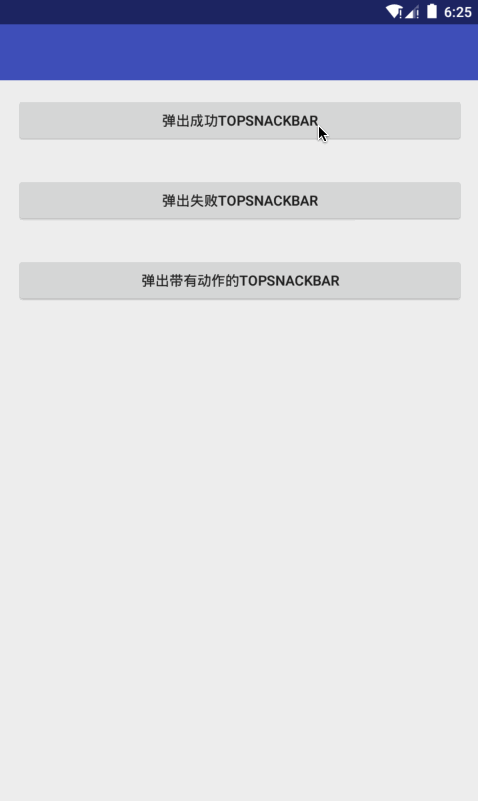

# TopSnackbar
[  ](https://bintray.com/isanwenyu/maven/TopSnackbar/_latestVersion)

 TopSnackbars provide brief feedback about an operation through a message at the top of the screen. 
 @see android.support.design.widget.Snackbar
 
## Getting Started
- Gradle

```
compile 'com.isanwenyu.TopSnackbar:topsnackbar:1.0.0'
```
- Maven

```
<dependency>
  <groupId>com.isanwenyu.TopSnackbar</groupId>
  <artifactId>topsnackbar</artifactId>
  <version>1.0.0</version>
  <type>pom</type>
</dependency>
```


## Quick Overview



## Usage
- Custom Attributes
 **You can also use all of attributes in snackbar！**

Method | Description
------- | -------
TopSnackbar setIcon(@DrawableRes int drawableId) | Update the left icon in this {@link TopSnackbar}
TopSnackbar setIcon(@NonNull Drawable drawable) |  Update the left icon in this {@link TopSnackbar}
TopSnackbar setBackGround(@DrawableRes int drawableId) | Update the background in this {@link TopSnackbar}
TopSnackbar setBackGround(@NonNull Drawable drawable) | Update the background in this {@link TopSnackbar}
TopSnackbar setLayoutGravity(@NonNull int gravity) | Update the gravity in this {@link TopSnackbarLayout}
TopSnackbar setLayoutHeight(@NonNull int height) | Update the height in this {@link TopSnackbarLayout}

- TopSnackbarUtil

```
    /**
     * 显示错误信息的最终实现类
     *
     * @param view            token
     * @param msgText         消息文本
     * @param actionText      响应文本
     * @param onClickListener 响应事件
     * @param callback        显示隐藏的回调
     * @return TopSnackbar TopSnackbar对象
     */
    public static TopSnackbar showFail(View view, String msgText, String actionText, View.OnClickListener onClickListener, TopSnackbar.Callback callback) {
        TopSnackbar snackbar = getTopSnackbar(view, msgText, actionText, onClickListener, callback).setIcon(com.isanwenyu.topsnackbar.R.drawable.ic_info_outline_white_18dp).setBackGround(COLOR_FAIL);
        snackbar.show();
        return snackbar;
    }


    /**
     * 显示成功信息的最终实现类
     *
     * @param view            token
     * @param msgText         消息文本
     * @param actionText      响应文本
     * @param onClickListener 响应事件
     * @param callback        回调显示或隐藏
     * @return TopSnackbar TopSnackbar对象
     */
    public static TopSnackbar showSuccess(View view, String msgText, String actionText, View.OnClickListener onClickListener, TopSnackbar.Callback callback) {
        TopSnackbar snackbar = getTopSnackbar(view, msgText, actionText, onClickListener, callback).setIcon(com.isanwenyu.topsnackbar.R.drawable.ic_check_circle_white_18dp).setBackGround(COLOR_SUCCESS);
        snackbar.show();
        return snackbar;
    }

    /**
     * 获取TopSnackBar 单一实现
     *
     * @param view            token
     * @param msgText         消息文本
     * @param actionText      响应文本
     * @param onClickListener 响应事件
     * @param callback        显示隐藏的回调
     * @return TopSnackbar TopSnackbar对象
     */
    @NonNull
    public static TopSnackbar getTopSnackbar(View view, String msgText, String actionText, View.OnClickListener onClickListener, TopSnackbar.Callback callback) {
        return TopSnackbar.make(view, msgText, hasAction(actionText, onClickListener) ? TopSnackbar.LENGTH_LONG : TopSnackbar.LENGTH_SHORT).setAction(actionText, onClickListener).setCallback(callback).setLayoutHeight(view.getMeasuredHeight());
    }

    /**
     * 根据传入的参数判断TopSnackbar是否包含action动作
     *
     * @param actionText      动作文本
     * @param onClickListener 动作监听
     * @return true:包含动作 false:不包含
     */
    private static boolean hasAction(String actionText, View.OnClickListener onClickListener) {
        return !TextUtils.isEmpty(actionText) && onClickListener != null;
    }

```

## Todo

 ~~加入中央仓库~~ <br>
 从顶部整体弹出实现 <br>
 修复setLayoutGravity无效问题

## License

    Copyright 2016 isanwenyu@163.com

    Licensed under the Apache License, Version 2.0 (the "License");
    you may not use this file except in compliance with the License.
    You may obtain a copy of the License at

       http://www.apache.org/licenses/LICENSE-2.0

    Unless required by applicable law or agreed to in writing, software
    distributed under the License is distributed on an "AS IS" BASIS,
    WITHOUT WARRANTIES OR CONDITIONS OF ANY KIND, either express or implied.
    See the License for the specific language governing permissions and
    limitations under the License.
